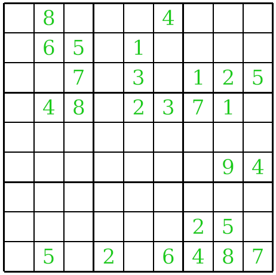

# sudoku
A sudoku game written in Rust using ggez.



The sudoku engine can support n-sized sudokus but the game only uses standard 9x9 grids. You can still modify the source code to play with bigger (or smaller) sudoku grids and everything will still work.

## Running

Just type
```
cargo run --release
```

## Controls
* `1-9`: Select the value to place
* `Tab`: Automatically place a new value

When the grid is full the game automatically resets.
